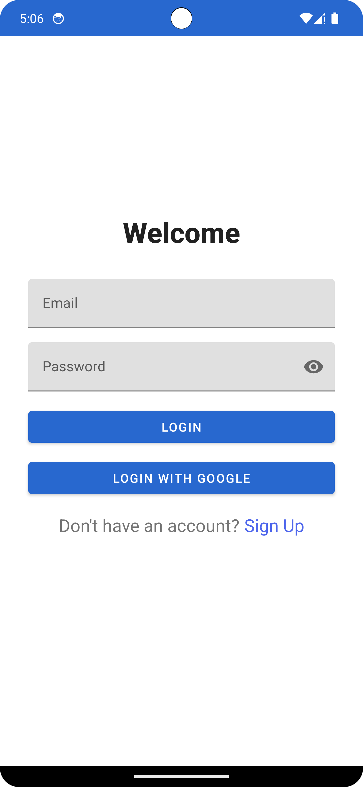
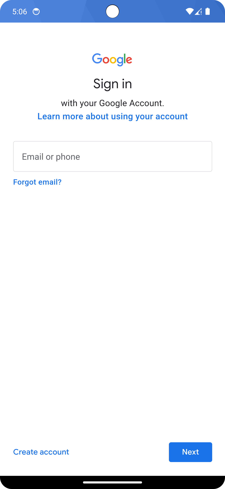
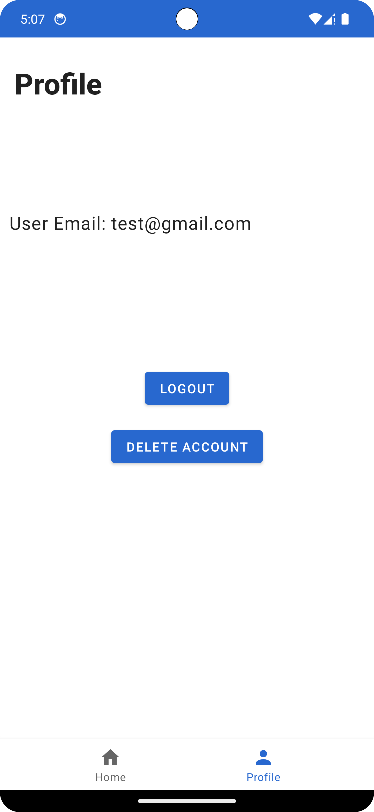
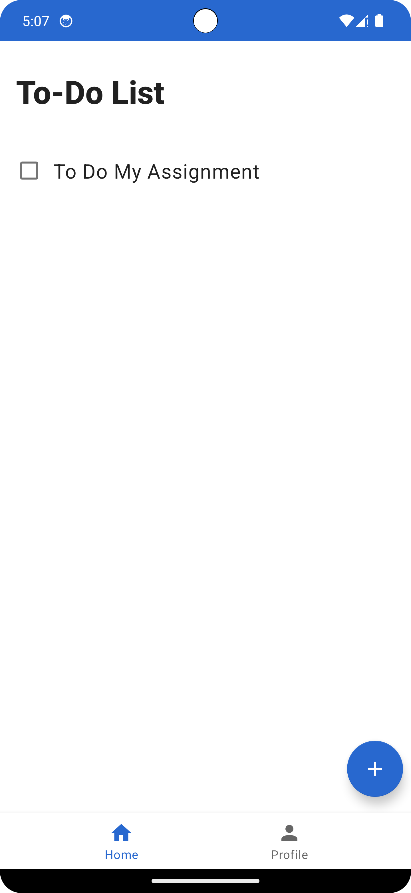

# Todo Application

## Introduction
The Todo Application is an Android app designed to enhance productivity by enabling users to efficiently manage their daily tasks. It leverages modern Android development tools and practices, including ViewModel, LiveData, Firebase Auth, Firestore, Room for local data persistence, and Dagger-Hilt for dependency injection.

## Features
- User authentication (Sign In/Sign Up) using Firebase Auth.
- Create, read, update, and delete (CRUD) tasks.
- Offline access with local data persistence through Room, and cloud synchronization with Firestore.
- Clean and intuitive user interface following Material Design principles.

## Screenshots
Here are some screenshots that highlight the app's functionality and UI:

## Technical Details

### Architecture
The app follows the MVVM architectural pattern, facilitating a separation of concerns and easier testing and maintenance.

### Dependencies
- Firebase Auth and Firestore for authentication and real-time database.
- Room for local data persistence.
- Dagger-Hilt for dependency injection.
- Navigation Component for in-app navigation.

### Code Structure
Organized into packages: /ui for user interface classes, /data for data management, /viewmodel for ViewModel classes, and /di for dependency injection modules.

## Contributing
Contributions to the Todo Application are welcome! Whether it's through submitting pull requests, reporting bugs, or suggesting enhancements, all forms of contributions are appreciated.

## Acknowledgments
- Thanks to the Android and Firebase communities for extensive documentation and tutorials.
- Special thanks to all contributors who have helped improve this app.
